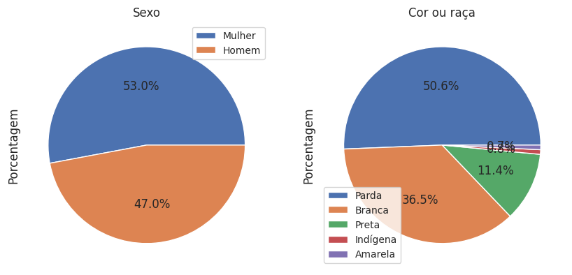
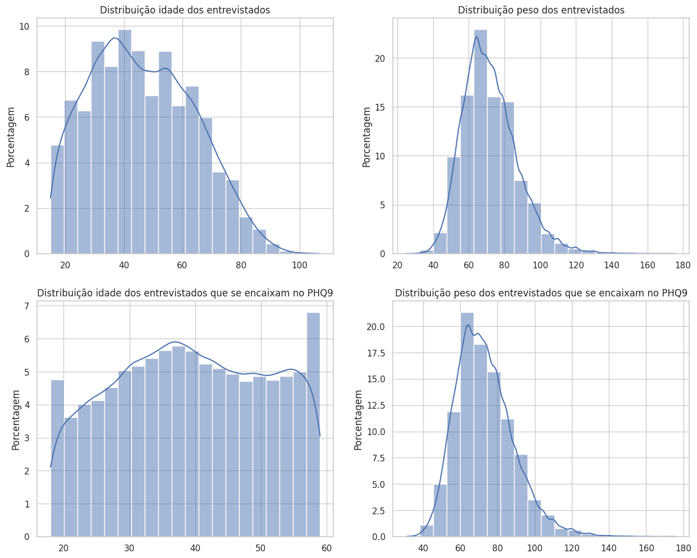
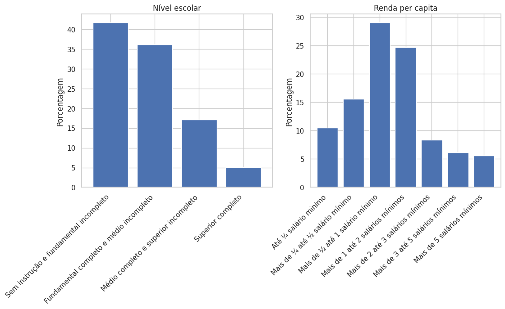
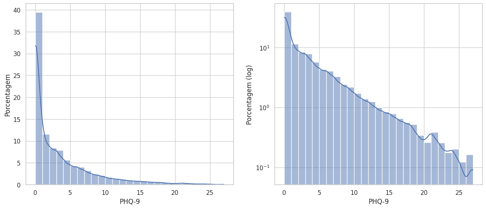
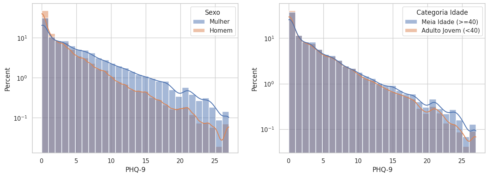
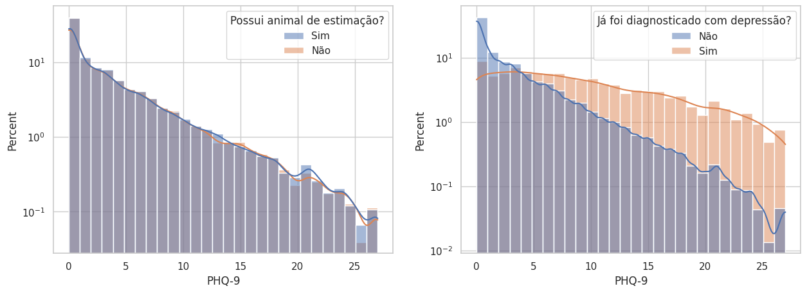
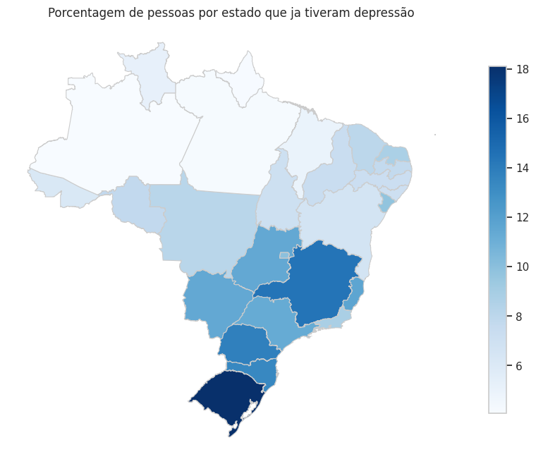
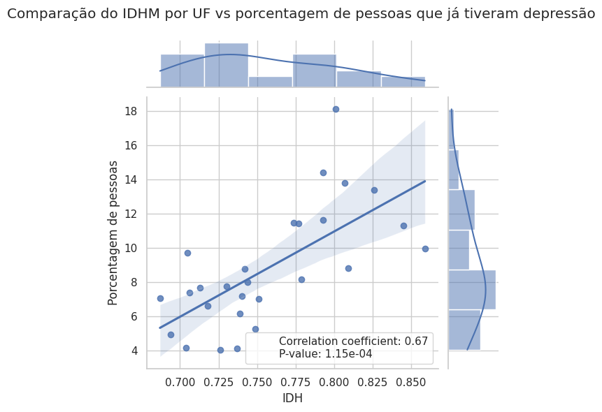
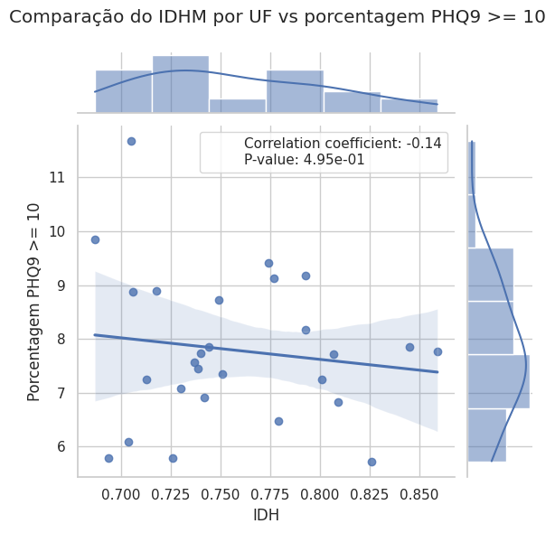

# Projeto `Associação de fatores de estilo de vida com depressão`
### Project `Association of lifestyle factors with depression`

# Apresentação

O presente projeto foi originado no contexto das atividades da disciplina de pós-graduação [*Ciência e Visualização de Dados em Saúde*](https://github.com/datasci4health/home), oferecida no primeiro semestre de 2023, na Unicamp.

|Nome  | RA | Especialização|
|--|--|--|
| Beatriz Silva Nunes  | 167428  | Saúde - [Conta GitHub](https://github.com/beatrizsnunes)|
| Arthur Rezende Salles   | 166003  | Computação - Líder Github - [Conta GitHub](https://github.com/Arthur-Salles)|
| Anderson Nogueira Cotrim  | 163993  | Computação - [Conta GitHub](https://github.com/AndersonCotrim)|
| Guilherme Magalhães Soares  | 217241  | Elétrica - [Conta GitHub](https://github.com/gsoso01)|

# Descrição Resumida do Projeto

As doenças crônicas não transmissíveis (DCNT) são um problema de saúde pública global [1]. DCNT estão associadas a diversos fatores de risco, dentre eles o uso de tabaco, inatividade física, consumo excessivo de álcool e dietas não saudáveis [1]. Entre as doenças crônicas temos a desordem depressiva ou depressão que é uma doença mental comum, caracterizada como uma persistência da tristeza e baixo interesse ou prazer em atividades anteriormente colocadas como comuns ou agradáveis [2, 3].

A depressão afeta cerca de 5% da população adulta mundial [2]. O tratamento da depressão é complexo e infelizmente ineficaz, reduz somente cerca de um terço da carga da desordem depressiva [4]. Com isso, a prevenção é a melhor forma de combater a depressão, similarmente a situação de outras doenças crônicas não transmissíveis como a obesidade.

Compreender as características da população com depressão e os fatores de risco associados à doença no Brasil é essencial para o desenvolvimento de políticas públicas e diretrizes considerando as particularidades da população brasileira.

A utilização de inquéritos de saúde nacional se torna extremamente pertinente para a compreensão da prevalência da doença e dos fatores associados, visto que são produzidos com amostragens representativas da população brasileira e têm o propósito de orientar diretrizes e políticas públicas de Saúde no país [5].

Com isso, o objetivo do estudo é buscar comportamentos de saúde e doenças crônicas não transmissiveis mais determinantes para o diagnóstico da depressão possibilitando auxiliar na prevenção do desenvolvimento da depressão.

[Link para vídeo de apresentação da proposta do projeto](https://drive.google.com/file/d/1uQ0wQsbig9BBA0OvvMyG8jLpcLTL104L/view?usp=share_link)

1. Hunter DJ, Reddy KS. Noncommunicable Diseases. N Engl J Med [Internet]. 2013 [cited 2023 Apr 14];369(14):1336–43. Available from: https://www.who.int/health-topics/noncommunicable-diseases#tab=tab_1

2. World Health Organisation. Mental health in emergencies [Internet]. 2019 [cited 2023 Apr 14]. p. 1–70. Available from: https://www.who.int/news-room/fact-sheets/detail/mental-health-in-emergencies

3. Soares B, Kanevsky G, Teng CT, Pérez-Esparza R, Bonetto GG, Lacerda ALT, et al. Prevalence and Impact of Treatment-Resistant Depression in Latin America: a Prospective, Observational Study. Psychiatr Q [Internet]. 2021 Dec 1 [cited 2023 Apr 14];92(4):1797–815. Available from: /pmc/articles/PMC8531108/

4. Chisholm D, Sanderson K, Ayuso-Mateos JL, Saxena S. Reducing the global burden of depression: Population-level analysis of intervention cost-effectiveness in 14 world regions. Br J Psychiatry [Internet]. 2004 May [cited 2023 Apr 14];184(MAY):393–403. Available from: https://pubmed.ncbi.nlm.nih.gov/15123502/

5. Stopa SR, Szwarcwald CL, Oliveira MM de, Gouvea E de CDP, Vieira MLFP, Freitas MPS de, et al. Pesquisa Nacional de Saúde 2019: histórico, métodos e perspectivas. Epidemiol e Serv saude Rev do Sist Unico Saude do Bras [Internet]. 2020 [cited 2023 Apr 14];29(5):e2020315. Available from: http://scielo.iec.gov.br/scielo.php?script=sci_arttext&pid=S1679-49742020000500035&lng=pt&nrm=iso&tlng=pt

# Perguntas de Pesquisa

Algumas perguntas de pesquisa foram pensadas visando uma compreensão aprofundada da prevalência e fatores de risco associados à depressão no Brasil.

****a minha sugestão é não respondermos as questões aqui e sim nos resultados, aqui deixar apenas as questões;

 - Quais hábitos de vida estão associados à depressão? 
 - É possível quantificar o grau de impacto de cada hábito, considerando tanto as influências positivas quanto negativas? 
 - A influência desses fatores varia ao longo do curso da vida e de variaveis sociodemográficas?
- Será que os comportamentos de saúde e/ou doenças crônicas não transmissíveis são determinantes para o diagnóstico de depressão? 

Através dos experimentos exploratórios, análise de correlação e gráficos de distribuição, foram confirmados alguns fatores associados com a depressão (utilizando χ2 de Pearson), como fumar tabaco, atividade física, algumas doenças crônicas, variaveis que estão em consonância com a literatura existente. Essas descobertas já contribuem para responder a primeira questão de pesquisa.

Para abordar a segunda questão, pretende-se utilizar a análise de regressão logística. Essa abordagem permitirá avaliar de forma mais precisa o grau de impacto de cada hábito, considerando tanto as influências positivas quanto as negativas, relacionadas à depressão.

Em relação à terceira questão, observou-se uma diferença na distribuição do potencial de depressão em relação à idade. No entanto, os fatores que influenciam essa diferença serão confrontados e explorados por meio da análise de regressão logística, possibilitando uma compreensão mais aprofundada.

Quanto às demais questões de pesquisa, espera-se aprimorar os resultados obtidos até o momento e fornecer contribuições mais significativas na entrega final.

# Metodologia

Este trabalho de forma geral procura avaliar e descobrir os fatores de risco para a depressão no Brasil. Para este fim, abordaremos uma metodologia baseada quatro estratégias principais:

- Realização de um estudo bibliográfico, que permitirá entender os padrões esperados para cada pergunta de pesquisa.
- Análise exploratória, incluindo seleção e pré-processamento dos dados. Mostrar o que os dados de forma macro contam diretamente. Exemplos: como é a distribuição da depressão pelas regiões do Brasil? Há correlação com IDH regional? Como essa doença se evoluiu ao longo dos anos no Brasil e em cada Estado? 
- Realização de uma análise estatística, utilizando técnicas de estatística descritiva e visualização, como gráficos de dispersão, caixa, e barras, a fim de extrair conhecimento dos dados.
- Aplicação de técnicas de aprendizado de máquina (regressão), que nos permita uma análise aprofundada e a quantificação da relevância de cada característica para variável de interesse (depressão). 

## Bases de Dados e Evolução

### Bases Estudadas mas Não Adotadas

Base de Dados  | Descrição | Anos
----- | ----- |  -----
[Pesquisa Nacional de Saúde do Escolar (PeNSE)](https://www.ibge.gov.br/en/statistics/social/population/16837-national-survey-of-school-health-editions.html?=&t=downloads) | O Instituto Brasileiro de Geografia e Estatística - IBGE - realiza a Pesquisa Nacional de Saúde do Escolar (PeNSE), em diversas cidades do Brasil, em parceria com o Ministério da Saúde e com o apoio do Ministério da Educação. Os objetivos da pesquisa são: conhecer e medir fatores de risco e de proteção relacionados à saúde dos adolescentes; apoiar o monitoramento da saúde dos estudantes brasileiros; oferecer orientação às iniciativas de saúde voltadas para esse grupo populacional, fornecendo informações confiáveis sobre o assunto. | 2019 (último)

Esta base de dados possui um total de 159245 alunos, com 306 características cada. Os dados estão estruturados e contam com dicionário. Inicialmente, tentamos utilizá-la para especificar mais o escopo da proposta de análise da depressão em adolescentes. Exploramos essa base por meio dos arquivos Jupyter Notebook, [pense_preprocessing.ipynb](notebooks/pense_preprocessing.ipynb) e [pense_hello_world.ipynb](notebooks/pense_hello_world.ipynb). No entanto, apesar do grande número de características, percebemos que essa base aborda pouco sobre doenças crônicas e apresenta algumas limitações relacionadas à saúde mental. Infelizmente, não encontramos nenhum indicador de depressão como o [PHQ9](https://www.mdcalc.com/calc/1725/phq9-patient-health-questionnaire9) que possa ser utilizado como na PNS (Pesquisa Nacional de Saúde).

Base de Dados  | Descrição | Anos
----- | ----- |  -----
[Sistema de Vigilância de Fatores de Risco e Proteção para Doenças Crônicas por Inquérito Telefônico (Vigitel)](https://svs.aids.gov.br/download/Vigitel/) | O Vigitel é parte integrante do sistema de Vigilância de Fatores de Risco para doenças crônicas não transmissíveis (DCNT) do Ministério da Saúde, juntamente com outros inquéritos, como os domiciliares e os direcionados à população escolar. Conhecer a situação de saúde da população é o primeiro passo para planejar ações e programas que possam reduzir a ocorrência e a gravidade dessas doenças, melhorando assim a saúde da população. A pesquisa Vigitel é realizada anualmente pela Secretaria de Vigilância em Saúde (SVS) do Ministério da Saúde e as entrevistas telefônicas são conduzidas com amostras da população adulta (18 anos ou mais) residente em domicílios com linha de telefone fixo. A partir de 2022, as entrevistas também passaram a ser realizadas em telefones celulares. | 2006-2021

Não tivemos a oportunidade de explorar a fundo essa base de dados, mas, à primeira vista, ela parece apresentar um número mais limitado de características (~300) em comparação com o PNS (~1000) que aborda de forma mais abrangente os fatores de estilo de vida que propomos analisar. Além disso, essa base de dados possui informações verificáveis se o diagnóstico de depressão já foi feito, mas não oferece parâmetros para avaliar o estado atual da saúde mental do entrevistado no momento da coleta dos dados.

### Bases Estudadas e Adotadas

O presente estudo utilizou como fonte de dados a [Pesquisa Nacional de Saúde de 2019](https://www.ibge.gov.br/estatisticas/sociais/saude/9160-pesquisa-nacional-de-saude.html?=&t=downloads), a qual possui uma amostra da população brasileira residente em domicílios particulares de todo o território brasileiro. Essa pesquisa foi desenvolvida pelo Instituto Brasileiro de Geografia e Estatística (IBGE) em parceria com o Ministério da Saúde e tem como objetivo coletar informações sobre o desempenho do sistema nacional de saúde em relação ao acesso e uso dos serviços disponíveis, bem como garantir a continuidade dos cuidados necessários. Além disso, a pesquisa visa avaliar as condições de saúde da população, monitorar doenças crônicas não transmissíveis e identificar os principais fatores de risco associados a elas. Detalhes sobre o processo de amostragem dessa pesquisa foram publicados[6].

O dicionário disponibilizado pela PNS pode ser encontrado [aqui](data/raw/PNS_2019/dicionario.xlsx). O dicionário dispõe das perguntas feitas aos indivíduos e as possíveis respostas. Nota-se a grande variedade de perguntas relacionadas a doenças crônicas e aos hábitos do domicílio. 

Foi necessáro filtrar de forma arbitrária as variáveis relevantes para responder às questões de pesquisa escolhidas anteriormente e as categorizamos de acordo com a literatura. Originou um banco de dados para a análise do estudo com perguntas para caracterização da amostra como sexo, cor ou raça, nível de escolaridade, renda média, características do domicílio, para verificação de comportamentos de saúde como consumo de álcool, tabaco, hábitos alimentares e atividade física, e para avaliar as doenças crônicas como peso, altura e diagnóstico de alguma doença crônica não transmissível (doenças cardíacas, artrite, diabetes, entre outras) por algum médico especialista. 
Ao final desse processamento obtivemos 90846 linhas e 380 colunas de dados relevantes para as perguntas de pesquisa.

**Variável dependente ou desfecho:**

A prevalência de depressão na população estudada foi avaliada através da aplicação do indicador PHQ9, que indica a severidade da doença em cinco intervalos: nenhum ou mínimo, leve, moderada, moderadamente grave e grave. Para as análises, as pessoas com pontuação igual ou superior a 10 pontos do indicador foram classificadas com depressão.

Apenas pessoas com idade entre 18 e 59 anos podem ser avaliadas neste índice. Com isso, o estudo foi delimitado a este intervalo de idade e retiramos as mulheres grávidas do estudo,devido a especificidade metodológica (n=736), obtendo uma amostra de 64664 indivíduos.
Variáveis independentes de doenças crônicas não transmissíveis, comportamentos de saúde e sociodemográficas:
Variáveis relacionadas às doenças crônicas não transmissíveis:
Presença de artrite, AVC, doenças cardiovasculares, hipertensão, hipercolesterolemia, diabetes: sim ou não;
Presença de obesidade: calculamos o IMC dos indivíduos (peso/altura²) e classificamos com obesidade, os indivíduos com IMC superior ou igual a 30 (sim/não).

**Variáveis relacionadas aos comportamentos de saúde:**

Alimentação: aplicamos um score de consumo de produtos ultraprocessados de 0 a 10 pontos, o qual é baseado na resposta positiva de consumo no dia anterior dos seguintes alimentos[7]: 1- Refrigerante; 2- Suco de fruta em caixinha ou lata ou refresco em pó; 3- Bebida achocolatada ou iogurte com sabor; 4- Salgadinho de pacote ou biscoito/bolacha salgado; 5- Biscoito/bolacha doce ou recheado ou bolo de pacote; 6- Sorvete, chocolate, gelatina, flan ou outra sobremesa industrializada; 7- Salsicha, linguiça, mortadela ou presunto; 8- Pão de forma, de cachorro-quente ou de hambúrguer; 9- Margarina, maionese, ketchup ou outros molhos ultraprocessados; 10- Macarrão instantâneo, sopa de pacote, lasanha congelada ou outro prato congelado comprado pronto industrializado. Quanto maior a pontuação do score, maior o consumo de ultraprocessados, ou seja, menos saudável é a dieta. 

Exercício físico[8]: prática de exercício físico nos últimos 3 meses (sim/não).

Consumo de álcool[9]: consumo de bebidas alcoólica uma vez ou mais por mês (sim/não) 

Tabagismo[8]: faz uso de algum tipo de tabaco (sim/não)

Variáveis relacionadas ao perfil sociodemográfico:

Escolaridade: Sem instrução e fundamental incompleto, fundamental completo e médio incompleto, médio completo e superior incompleto, superior completo.

Sexo: feminino ou masculino

Idade: 

Renda:

Localidade: região geográfica dos indivíduos (Norte, Nordeste, Centro, Sul, Sudeste);

**Análises dos dados:**

Realizamos uma análise descritiva da amostra do estudo e averiguamos as correlações entre a variável dependente e as variáveis independentes. Em seguida, a fim de verificar a importância dos determinantes e a influência deles no diagnóstico de depressão construímos 3 modelos modificando as variáveis determinantes, sendo que no primeiro modelo selecionamos apenas as variáveis de comportamentos de saúde, no segundo modelo selecionamos apenas as variáveis de doenças crônicas não transmissíveis e no último modelo selecionamos tanto as variáveis de comportamentos de saúde, quanto às doenças crônicas não transmissíveis, todos os modelos foram ajustados pelas variáveis sociodemográficas. 

Abaixo temos um resumo do workflow dos experimentos realizados com esta base:

Nas proximas seções decrevemos uma análise exploratoria inicial e mais detalhes desta base.

6. Stopa SR, Szwarcwald CL, Oliveira MM de, Gouvea E de CDP, Vieira MLFP, Freitas MPS de, et al. Pesquisa Nacional de Saúde 2019: histórico, métodos e perspectivas. Epidemiol e Serv saude  Rev do Sist Unico Saude do Bras [Internet]. 2020 [cited 2023 Apr 14];29(5):e2020315. Available from: http://scielo.iec.gov.br/scielo.php?script=sci_arttext&pid=S1679-49742020000500035&lng=pt&nrm=iso&tlng=pt

7. 	dos Santos Costa C, Steele EM, de Faria FR, Monteiro CA. Score of ultra-processed food consumption and its association with sociodemographic factors in the Brazilian National Health Survey, 2019. Cad Saude Publica [Internet]. 2022 May 6 [cited 2023 Jun 21];38:e00119421. Available from: https://www.scielo.br/j/csp/a/QP4GrYT7cS6YCLrrTKtPvjp/?lang=en
   
8. 	Berti De Azevedo Barros M, De L, Medina PB, Lima G, Soares De Azevedo RC, Ferreira N, et al. Associação entre comportamentos de saúde e depressão: resultados da Pesquisa Nacional de Saúde de 2019. Rev Bras Epidemiol [Internet]. 2021 Dec 10 [cited 2023 Jun 21];24:e210010. Available from: https://doi.org/10.1590/1980-549720210010.supl.2
   	
9. 	de Sousa KT, Marques ES, Levy RB, Azeredo CM. Food consumption and depression among Brazilian adults: results from the Brazilian National Health Survey, 2013. Cad Saude Publica [Internet]. 2019 Dec 20 [cited 2023 Jun 21];36(1):e00245818. Available from: https://www.scielo.br/j/csp/a/75WMGWKGMvLZXR9CbJWd7sP/?lang=en

## Análise Exploratória

Nesta seção, apresentamos algumas características identificadas na base de dados selecionada, juntamente com os resultados da análise exploratória.

### Características descritivas da população

Os gráficos abaixo descrevem a proporção em relação a sexo, cor ou raça das amostras da população. Onde podemos observar um balanceamento em gênero e a predominância parda na categoria cor ou raça.

Abaixo podemos observar curvas de distribuição dos indivíduos da base em relação à idade e peso, podemos notar que estas curvas estão num intervalo de valores a primeira vista aceitável indicando que, aparentemente, grande parte dos dados em relação a este atributo estão confiáveis. Mais abaixo temos a distribuição destas mesmas características, porém limitados à amostragem aplicável ao PHQ9 (pessoas de 18 a 59 anos).

Por fim nos gráficos de barras abaixo temos a proporção do nível escolar e da renda per capita da população estudada:

Em relação à distribuição do valor PHQ9 (inteiro de 0 à 27) num comportamento similar ao uma exponencial negativa, conforme podemos observar na figura abaixo:

Nas figuras abaixo podemos comparar as distribuições do score PHQ-9 confrontadas com algumas variáveis de interesse.

Abaixo temos o gráfico da porcentagem de pessoas que já disseram diagnosticadas por depressão por estado brasileiro.

Curiosamente, notou-se uma alta correlação entre o IDH médio de cada estado com a porcentagem de depressão.

O grupo suspeita que essa observação está relacionada ao fato de que o diagnóstico de depressão ou sua ausência está fortemente ligado à disponibilidade e facilidade de acesso aos serviços de saúde, o que tende a ser mais comum em regiões com um Índice de Desenvolvimento Humano (IDH) mais elevado. 

Avaliando o PHQ9 (indicativo acima de moderado) questionário aplicado durante à entrevista obtivemos o gráfico de correlação abaixo, reforçando a suspeita observada acima.

### Testes de associação

Devido ao fato das nossas variáveis de interesse serem qualitativas, utilizamos o teste χ2 de Pearson para buscar associação.
Primeiramente, buscamos associações entre as variáveis que possam nos auxiliar na discussão dos achados, por exemplo, percepção de saúde e nível de escolaridade e percepção de saúde e raça-cor, e minimizar as variáveis de caracterização da amostra, como associação entre nível de escolaridade e renda per capita. 

| Variáveis confrontadas                                 |        χ2 |   p-value |
|:-------------------------------------------------------|----------:|----------:|
| Nível de escolaridade e renda per capita               |  23047.00 |         0 |
| Percepção de saúde e nível de escolaridade             |   6137.04 |         0 |
| Percepção de saúde segundo OMS e nível de escolaridade |   4083.09 |         0 |
| Percepção de saúde e raça-cor                          |   1020.99 |         0 |
| Percepção de saúde segundo OMS e raça-cor              |    695.94 |         0 |

Em seguida, realizamos associações entre variáveis de caracterização dos indivíduos com alto potencial de depressão baseado no score PHQ9. Obtivemos que sexo, cor, idade, escolaridade, percepção da própria saúde, percepção da saúde segundo OMS, renda per capita possui associação (p< 0,05) com alto potencial de depressão.

| Variáveis confrontadas com alto potencial de depressão (PHQ9 score > 20) |        χ2 |    p_value |
|:-------------------------------------------------------------------------|----------:|-----------:|
| Sexo                                                                     |    650.12 |          0 |
| Cor                                                                      |     27.46 |    0.00005 |
| Categoria idade                                                          |     23.64 |          0 |
| Escolaridade                                                             |      9.63 |    0.02198 |
| Percepção da própria saúde                                               |   3007.41 |          0 |
| Percepção da saúde segundo a OMS                                         |   4762.96 |          0 |
| Possui animal de estimação?                                              |      2.64 |   0.10445* |
| Renda per capita                                                         |    263.28 |          0 |
| Frequência bebida alcoólica                                              |      2.61 |   0.27098* |
| Fuma tabaco                                                              |    101.61 |          0 |
| Atividade física nos últimos 3 meses                                     |    105.78 |          0 |
| Teve diagnostico artrite ou reumatismo                                   |    183.69 |          0 |
| Teve diagnostico AVC                                                     |     50.22 |          0 |
| Teve diagnostico doenças cardiovasculares                                |    150.73 |          0 |
| Teve diagnostico hipercolesterolemia                                     |    130.91 |          0 |
| Teve diagnostico diabetes                                                |     13.57 |    0.00023 |
| Teve diagnostico pressão alta                                            |     35.73 |          0 |
| Teve diagnostico câncer                                                  |      5.25 |    0.02193 |
| Teve diagnostico depressão                                               |   4597.09 |          0 |

Em relação aos hábitos de vida, encontramos associação entre fumar tabaco e atividade física nos últimos 3 meses (p< 0,05), porém não encontramos associação entre consumo de bebida alcoólica e depressão (p=0,27). Neste bloco, pretendemos realizar análises sobre consumo alimentar, porém é necessário criar um índice a partir das informações presentes no inquérito, visto que são perguntas baseadas em um grupo de alimento ou alimento, por esse motivo, iremos buscar a associação de padrão alimentar saudável e não saudável com alto potencial de depressão para a próximo entrega. 
Por fim, analisamos as doenças crônicas não transmissíveis com depressão e verificamos que diagnóstico de artrite ou reumatismo, AVC, doenças cardiovasculares, hipercolesterolemia, diabetes, hipertensão e câncer estão associados com alto potencial de depressão. Como na análise de hábitos de vida, pretendemos incluir para próxima etapa a análise de associação de obesidade com alto potencial para depressão.
A partir dessas análises, pretendemos levar para o modelo final todas as variáveis de hábitos de vida e doenças crônicas não transmissíveis que possuem associação com o alto potencial de depressão.

# Ferramentas

Ferramenta | Descrição
----- | -----
Python 3 | Linguagem de programação a ser utilizada para o desenvolvimento das soluções propostas.
Jupyter Notebook | Código principal e solução reprodutível em arquivos de Jupyter Notebook, ajuda também na visualização de dados.
Pandas | Ferramenta para manipulação e análise de dados tabulares.
NumPy | Biblioteca utilizada para manipulação de vetores multidimensionais.
Scipy | Biblioteca com algoritmos/cálculos estatísticos gerais.
Matplotlib/Plotly/Seaborn | Bibliotecas para visualização dos dados.
Scikit-learn | Biblioteca com grande variedade de algoritmos de aprendizagem de máquina.
ChatGPT | Ferramenta imprescindível, quase outro integrante do grupo, também conhecido como o evangelista da programação.

# Cronograma

Semanas | Tarefas                                           | Conclusão
----- |---------------------------------------------------| -----
Semana 01 (16/04 - 22/04) | Definir escopo do projeto e revisão bibliográfica | :heavy_check_mark:
Semana 02 (23/04 - 29/04) | Compreensão do dados                              | :heavy_check_mark:
Semana 03 (30/04 - 06/05) | Processamento dos dados                           | :heavy_check_mark:
Semana 04 (07/05 - 13/05) | Processamento dos dados                           | :heavy_check_mark:
Semana 05 (14/05 - 20/05) | Análise exploratória e Entrega 2                  | :heavy_check_mark:
Semana 06 (21/05 - 27/05) | Modelagem da solução                              |
Semana 07 (28/05 - 03/06) | Modelagem da solução                              |
Semana 08 (04/06 - 10/06) | Análise e discussão dos resultados                |
Semana 09 (11/06 - 17/06) | Relatório                                         |
Semana 10 (18/06 - 24/06) | Apresentação e Entrega Final                      |

# Material bibliográfico

[Barros MBA, Lima MG, Azevedo RCS, Medina LBP, Lopes CS, Menezes PR, Malta DC. Depression and health behaviors in Brazilian adults - PNS 2013. Rev Saude Publica. 2017 Jun 1;51(suppl 1):8s. doi: 10.1590/S1518-8787.2017051000084. PMID: 28591352; PMCID: PMC5676399.](https://pubmed.ncbi.nlm.nih.gov/28591352/)

[Godos J, Bonaccio M, Al-Qahtani WH, Marx W, Lane MM, Leggio GM, Grosso G. Ultra-Processed Food Consumption and Depressive Symptoms in a Mediterranean Cohort. Nutrients. 2023 Jan 18;15(3):504. doi: 10.3390/nu15030504. PMID: 36771211; PMCID: PMC9919031.](https://pubmed.ncbi.nlm.nih.gov/36771211/)

[Tian YR, Deng CY, Xie HC, Long QJ, Yao Y, Deng Y, Zhao H, Li Y, Liu H, Xiao L. Ultra-processed food intake and risk of depression: a systematic review. Nutr Hosp. 2023 Feb 15;40(1):160-176. English. doi: 10.20960/nh.03723. PMID: 36537321.](https://pubmed.ncbi.nlm.nih.gov/36537321/)

[Melo, A. P. S., Bonadiman, C. S. C., Andrade, F. M. de ., Pinheiro, P. C., & Malta, D. C.. (2023). Depression Screening in a population-based study: Brazilian National Health Survey 2019. Ciência & Saúde Coletiva, 28(4), 1163–1174. https://doi.org/10.1590/1413-81232023284.14912022](https://www.scielo.br/j/csc/a/wWKFtv8ZVZZTwVDM94Q3gFt/)

[Elizabeth L, Machado P, Zinöcker M, Baker P, Lawrence M. Ultra-Processed Foods and Health Outcomes: A Narrative Review. Nutrients. 2020 Jun 30;12(7):1955. doi: 10.3390/nu12071955. PMID: 32630022; PMCID: PMC7399967.](https://pubmed.ncbi.nlm.nih.gov/32630022/)

[Antunes JT, Dumont-Pena Érica, Silva AG da, Moutinho C dos S, Vieira MLFP, Malta DC. A saúde mental dos adolescentes brasileiros: Pesquisa Nacional de Saúde do Escolar de 2019. REME Rev Min Enferm.](https://periodicos.ufmg.br/index.php/reme/article/view/38984)

[Lane MM, Gamage E, Travica N, Dissanayaka T, Ashtree DN, Gauci S, Lotfaliany M, O'Neil A, Jacka FN, Marx W. Ultra-Processed Food Consumption and Mental Health: A Systematic Review and Meta-Analysis of Observational Studies. Nutrients. 2022 Jun 21;14(13):2568. doi: 10.3390/nu14132568. PMID: 35807749; PMCID: PMC9268228.](https://pubmed.ncbi.nlm.nih.gov/35807749/)

[Hecht EM, Rabil A, Martinez Steele E, Abrams GA, Ware D, Landy DC, Hennekens CH. Cross-sectional examination of ultra-processed food consumption and adverse mental health symptoms. Public Health Nutr. 2022 Nov;25(11):3225-3234. doi: 10.1017/S1368980022001586. Epub 2022 Jul 28. PMID: 35899785; PMCID: PMC9991859.](https://pubmed.ncbi.nlm.nih.gov/35899785/)
